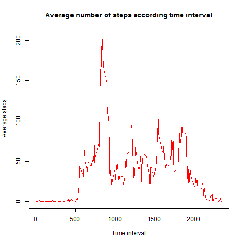
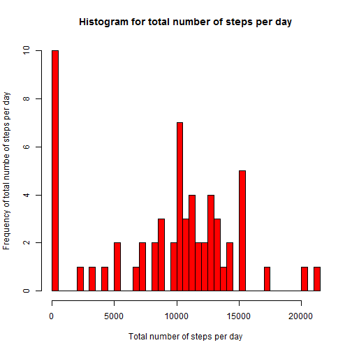
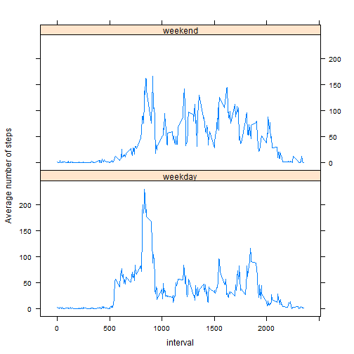

## Loading and preprocessing the data

```r
setwd("E:/Ellen/coursera/RepData_PeerAssessment1")
```

```r
Activity <- read.csv("activity.csv",stringsAsFactors=FALSE)
```

First, I look at the summary statistics and the format of the data:

```r
summary(Activity)
```

```
##      steps            date              interval     
##  Min.   :  0.00   Length:17568       Min.   :   0.0  
##  1st Qu.:  0.00   Class :character   1st Qu.: 588.8  
##  Median :  0.00   Mode  :character   Median :1177.5  
##  Mean   : 37.38                      Mean   :1177.5  
##  3rd Qu.: 12.00                      3rd Qu.:1766.2  
##  Max.   :806.00                      Max.   :2355.0  
##  NA's   :2304
```

```r
str(Activity)
```

```
## 'data.frame':	17568 obs. of  3 variables:
##  $ steps   : int  NA NA NA NA NA NA NA NA NA NA ...
##  $ date    : chr  "10/1/2012" "10/1/2012" "10/1/2012" "10/1/2012" ...
##  $ interval: int  0 5 10 15 20 25 30 35 40 45 ...
```
Note that I have used in the "read.csv" command the option "stringsAsFactors=False" as this would otherwise have read in the data variable as factors. In a next step, I convert the data variable which is according to the 'str' command a string variable into a data variable as follows:

```r
Activity$date = as.POSIXct(Activity$date, format="%m/%d/%Y")  
```

## What is mean total number of steps taken per day?

### Calculate the total number of steps taken per day
In order to compute the total number of steps per day, I use the following command that counts the total number of steps for each day in the dataset and plot a histogram with the result of the "tapply" function:

```r
Total_Day<-tapply(Activity$steps,Activity$date,sum,na.rm = TRUE)
Total_Day
```

```
## 2012-10-01 2012-10-02 2012-10-03 2012-10-04 2012-10-05 2012-10-06 
##          0        126      11352      12116      13294      15420 
## 2012-10-07 2012-10-08 2012-10-09 2012-10-10 2012-10-11 2012-10-12 
##      11015          0      12811       9900      10304      17382 
## 2012-10-13 2012-10-14 2012-10-15 2012-10-16 2012-10-17 2012-10-18 
##      12426      15098      10139      15084      13452      10056 
## 2012-10-19 2012-10-20 2012-10-21 2012-10-22 2012-10-23 2012-10-24 
##      11829      10395       8821      13460       8918       8355 
## 2012-10-25 2012-10-26 2012-10-27 2012-10-28 2012-10-29 2012-10-30 
##       2492       6778      10119      11458       5018       9819 
## 2012-10-31 2012-11-01 2012-11-02 2012-11-03 2012-11-04 2012-11-05 
##      15414          0      10600      10571          0      10439 
## 2012-11-06 2012-11-07 2012-11-08 2012-11-09 2012-11-10 2012-11-11 
##       8334      12883       3219          0          0      12608 
## 2012-11-12 2012-11-13 2012-11-14 2012-11-15 2012-11-16 2012-11-17 
##      10765       7336          0         41       5441      14339 
## 2012-11-18 2012-11-19 2012-11-20 2012-11-21 2012-11-22 2012-11-23 
##      15110       8841       4472      12787      20427      21194 
## 2012-11-24 2012-11-25 2012-11-26 2012-11-27 2012-11-28 2012-11-29 
##      14478      11834      11162      13646      10183       7047 
## 2012-11-30 
##          0
```
### Make a histogram of the total number of steps taken each day

```r
hist(Total_Day,breaks=60,col="red",
     main="Histogram for total number of steps per day",
     xlab="Total number of steps per day",
     ylab ="Frequency of total numbe of steps per day")
```

 

From the histogram, one can observe that on most days during the months October-November 2012, the subject took a total of approximately 10 000 steps.

## Calculate and report the mean and median of the total number of steps taken per day
From what I have calculated above (in the Total_Day), I compute the mean and the median:

```r
Mean_Steps <- mean(Total_Day)
Median_Steps <- median(Total_Day)
```
The subject took on average of 9354 on a given day. The median for the total number of steps on a given day is 10395.

## What is the average daily activity pattern?

### Time series plot (i.e. type = "l") of the 5-minute interval (x-axis) and the average number of steps taken, averaged across all days (y-axis)
In other words, what needs to be done is for each 5-minute interval, we need to average across the days. Rather than using the "tapply" function, I will be using the following function:

```r
##install.packages("doBy")
library(doBy)
Steps_Averages <-summaryBy(steps ~ interval, data=Activity,na.rm=TRUE)
```


```r
plot(Steps_Averages$interval,Steps_Averages$steps.mean,type='l',col="red",
     main="Average number of steps according time interval",
     xlab="Time interval",ylab="Average steps")
```

 
From the plot, one can see that there is a peak around the time interval 1000.

### Which 5-minute interval, on average across all the days in the dataset, contains the maximum number of steps?

```r
u <- which.max(Steps_Averages$steps.mean)
u
```

```
## [1] 104
```

```r
Maximum_Step <- Steps_Averages[u,1]
Maximum_Step
```

```
## [1] 835
```
The maximum number of steps occurs around time interval 835.

## Imputing missing values

### Calculate and report the total number of missing values in the dataset (i.e. the total number of rows with NAs)

In order to answer this question, I run simple summary statistics:

```r
summary(Activity)
```

```
##      steps             date               interval     
##  Min.   :  0.00   Min.   :2012-10-01   Min.   :   0.0  
##  1st Qu.:  0.00   1st Qu.:2012-10-16   1st Qu.: 588.8  
##  Median :  0.00   Median :2012-10-31   Median :1177.5  
##  Mean   : 37.38   Mean   :2012-10-31   Mean   :1177.5  
##  3rd Qu.: 12.00   3rd Qu.:2012-11-15   3rd Qu.:1766.2  
##  Max.   :806.00   Max.   :2012-11-30   Max.   :2355.0  
##  NA's   :2304
```
### Devise a strategy for filling in all of the missing values in the dataset. 

The only variable that has missing variables seems to be the variable "steps". In total, there are 2 304 missing observations. In order to impute this variable, I will replace the missing variable by the mean of the specific interval. Above I have already created by interval the average number of steps and the result is stored in "Steps_Averages". Everytime I find a missing observation, it will be imputed with the mean of the steps for that particular interval using thes previous results.

### Create a new dataset that is equal to the original dataset but with the missing data filled in.
More specifically, I this is how I coded it:

```r
# Loop over the dataset
for (i in 1:nrow(Activity)) {
  if (is.na(Activity$steps[i])) {# If the variable is missing
  #print(i)
  Interval <- Activity$interval[i] # Find out which interval it is
  #print(Interval)
  u <- which(Steps_Averages$interval == Interval)# Go back to dataset that I    
  #created earlier and find out the row that matches this interval
  Imputation <- Steps_Averages$steps.mean[u] #Obtain the average steps 
  #in that row
  #print(Imputation)
  Activity$steps[i] <-Imputation # Impute
  }
}
```
Now, I also run the summary statistics to see if there are still any missing variables:

```r
summary(Activity)
```

```
##      steps             date               interval     
##  Min.   :  0.00   Min.   :2012-10-01   Min.   :   0.0  
##  1st Qu.:  0.00   1st Qu.:2012-10-16   1st Qu.: 588.8  
##  Median :  0.00   Median :2012-10-31   Median :1177.5  
##  Mean   : 37.38   Mean   :2012-10-31   Mean   :1177.5  
##  3rd Qu.: 27.00   3rd Qu.:2012-11-15   3rd Qu.:1766.2  
##  Max.   :806.00   Max.   :2012-11-30   Max.   :2355.0
```
As can be seen from the results, there are no longer any missing variables.

### Make a histogram of the total number of steps taken each day and calculate and report the mean and median total number of steps taken per day.

I rerun the code from above for the histogram:

```r
hist(Total_Day,breaks=60,col="red",
     main="Histogram for total number of steps per day",
     xlab="Total number of steps per day",
     ylab ="Frequency of total numbe of steps per day")
```

 

At first sight, I do not see any differences in this histogram compared to the first one. Subsequently, I also compare the mean and the median total number of steps taken per day:

```r
Total_Day<-tapply(Activity$steps,Activity$date,sum)
Mean_Steps2 <- mean(Total_Day)
Mean_Steps2
```

```
## [1] 10766.19
```

```r
Median_Steps2 <- median(Total_Day)
Median_Steps2
```

```
## [1] 10766.19
```
The mean and the median are both equal to 10766. Previously, I had the following values for the mean and median respectively: 9354 and 10395. In other words, both the mean and the median are higher when the missing values for the variable steps are imputed.

## Are there differences in activity patterns between weekdays and weekends?

###Create a new factor variable in the dataset with two levels - "weekday" and "weekend" indicating whether a given date is a weekday or weekend day.

```r
Activity$weekday <-weekdays(Activity$date)
Weekend_List <- c("Saturday","Sunday")
Activity$Dummy_WE <-as.factor(Activity$weekday %in% Weekend_List)
# Re-label this dummy to "weekend" and "Weekday":
Activity$Dummy_WE2 <- factor(Activity$Dummy_WE, labels = c("weekday", "weekend"))
```
### Make a panel plot containing a time series plot (i.e. type = "l") of the 5-minute interval (x-axis) and the average number of steps taken, averaged across all weekday days or weekend days (y-axis).

First, I compute the average number of steps across each interval and split up whether the steps occured in a weekend or weekday. I am using another function than  "SummaryBy" and will use the "plyr" package:

```r
#install.packages("plyr")
library(plyr)
Steps_We <- ddply(Activity, c("interval", "Dummy_WE2"), summarise,
                mean.steps=mean(steps))
```
Finally, I make the plot where I split up the figure according weekday or weekend using the lattice library:

```r
library(lattice)
xyplot(mean.steps ~ interval | Dummy_WE2, 
type="l",data = Steps_We, layout = c(1, 2),ylab="Average number of steps")
```

 

As expected, during weekdays one can see a huge peak in the number of steps in the mornings with a peak towards the interval 1000. During the weekend, the number of steps across the intervals is more evenly distributed. 

